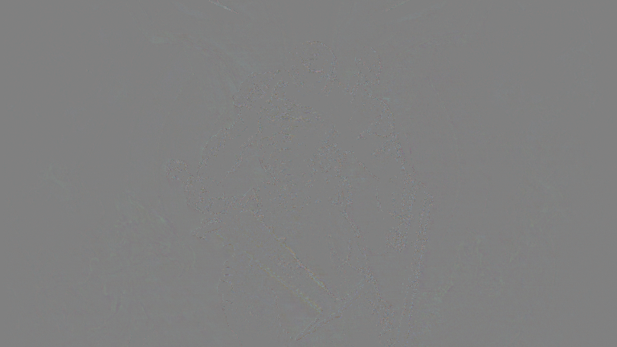
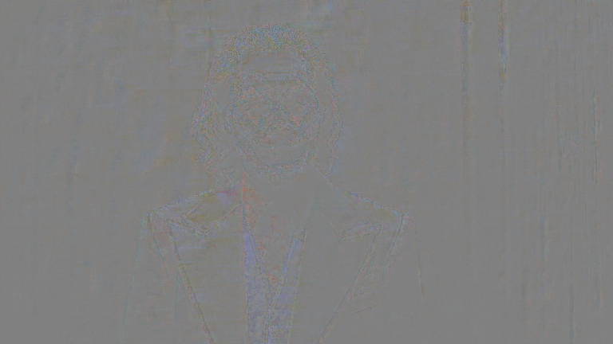

`ORG.IPEP:`

  

# rdopng-examples

Rate-Distortion Optimized Lossy PNG and QOI Encoding Tool ([rdopng](https://github.com/ImageProcessing-ElectronicPublications/rdopng))

[rdopng](https://github.com/ImageProcessing-ElectronicPublications/rdopng) is a command line tool which uses LZ match optimization, Lagrangian multiplier [rate distortion optimization (RDO)](https://en.wikipedia.org/wiki/Rate%E2%80%93distortion_optimization), a simple perceptual error tolerance model, and [Oklab](https://bottosson.github.io/posts/oklab/)-based colorspace error metrics to encode 24/32bpp PNG files which are 30-80% smaller relative to lodepng/libpng. The tool defaults to reasonably fast near-lossless settings which writes PNG's around 30-40% smaller than lossless PNG encoders.

Unlike [pngquant](https://pngquant.org/), rdopng does not use 256-color palettes or dithering. PNG files encoded by rdopng typically range between roughly 2.5-7bpp, depending on the options used (and how much time and patience you have).

Some example encodes and command lines are [here](https://github.com/richgel999/rdopng/wiki/Examples).

You can download a pre-built Windows binary [here](https://github.com/richgel999/rdopng/releases). You may need to install the [VS 2022 runtime redistributable from Microsoft](https://docs.microsoft.com/en-us/cpp/windows/latest-supported-vc-redist?view=msvc-170).

### Examples

| aliens.png [499788] |
| --- |
|  |
| aliens_rdo.png [261332] |
|  |
| aliens_2_rdo.png [206448] |
|  |

| crossyf.png [897010] |
| --- |
|  |
| crossyf_rdo.png [323624] |
|  |
| crossyf_2_rdo.png [265207] |
| |

| doom.png [464665] |
| --- |
|  |
| doom_rdo.png [279841] |
|  |
| doom_delta.png [320663] |
|  |

| gotham.png [591247] |
| --- |
|  |
| gotham_rdo.png [192478] |
|  |
| gotham_delta.png [554380] |
|  |
| gotham_2_rdo.png [171885] |
|  |
| gotham_2_delta.png [595632] |
|  |

| high_fidelity.png [514995] |
| --- |
|  |
| high_fidelity_1.png [363467] |
|  |
| high_fidelity_2.png [188568] |
|  |

| joker_768.png [339338] |
| --- |
|  |
| joker_768_rdo.png [137253] |
|  |
| joker_768_delta.png [362749] |
|  |
| joker_768_2_rdo.png [165524] |
|  |
| joker_768_2_delta.png [339650] |
|  |
| joker_768_3_rdo.png [225803] |
|  |
| joker_768_3_delta.png [280948] |
|  |
| joker_768_4_rdo.png [99386] |
|  |
| joker_768_4_delta.png [374280] |
|  |

| kodim18.png [777096] |
| --- |
|  |
| kodim18_rdo.png [235597] |
|  |
| kodim18_delta.png [624582] |
|  |

| lara_1024.png [1500821] |
| --- |
|  |
| lara_1024_rdo.png [1201499] |
|  |
| lara_1024_delta.png [666483] |
|  |

| magneto.png [153318] |
| --- |
|  |
| magneto_rdo.png [84790] |
|  |
| magneto_delta.png [117630] |
|  |
| magneto_2_rdo.png [72941] |
|  |
| magneto_2_delta.png [105569] |
|  |
| magneto_2_alpha_delta.png [4000] |
|  |

| masterchief.png [448582] |
| --- |
|  |
| masterchief_rdo.png [214551] |
|  |
| masterchief_2_rdo.png [172080] |
|  |

| minerology.png [888458] |
| --- |
|  |
| minerology_rdo.png [622869] |
|  |
| minerology_delta.png [487981] |
|  |

| puppy.png [1567850] |
| --- |
|  |
| puppy_rdo.png [593962] |
|  |
| puppy_delta.png [1278004] |
|  |

| stp.png [785006] |
| --- |
|  |
| stp_rdo.png [412128] |
|  |
| stp_delta.png [709160] |
|  |
| stp_2_rdo.png [321873] |
|  |
| stp_2_delta.png [778349] |
|  |
| stp_3_rdo.png [289303] |
|  |
| stp_3_delta.png [788024] |
|  |

| waterfall.png [2074607] |
| --- |
|  |
| waterfall_rdo.png [1202930] |
|  |
| waterfall_delta.png [1430319] |
|  |

| xfiles_768.png [500148] |
| --- |
|  |
| xfiles_768_rdo.png [301910] |
|  |
| xfiles_768_delta.png [355589] |
|  |
| xfiles_768_2_rdo.png [169558] |
|  |
| xfiles_768_2_delta.png [458052] |
|  |
